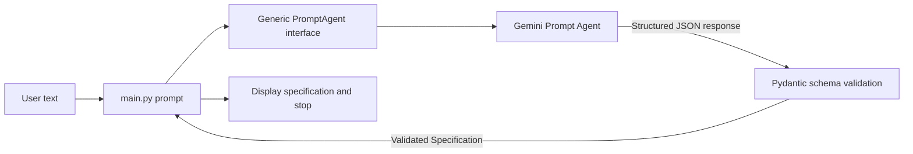
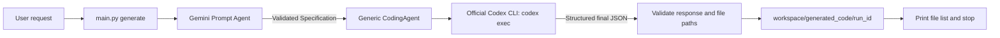
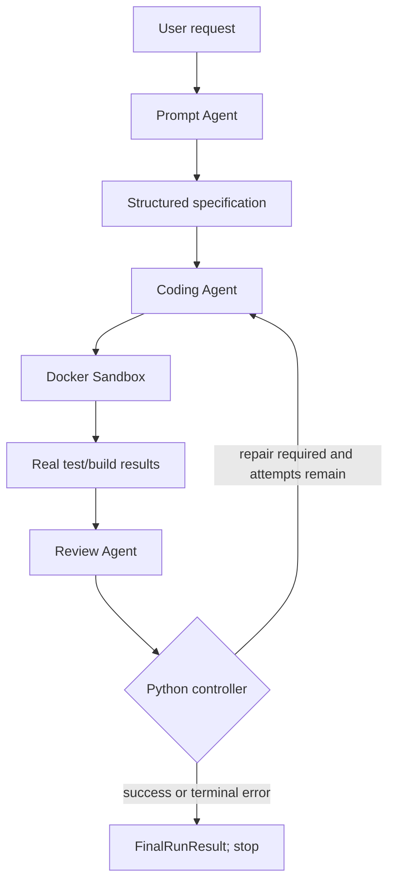
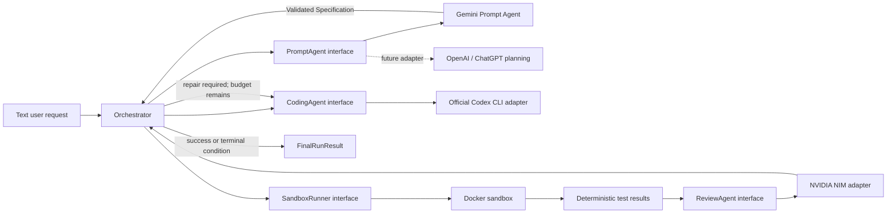
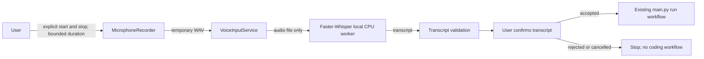

# ProCoder architecture

## Stage 2: prompt-only CLI

This command does not call the orchestrator, Coding Agent, Review Agent, Repair
Agent, or sandbox.

## Stage 3: generate-only CLI

The Codex adapter uses the documented local CLI `exec` mode rather than an
invented Python SDK/API endpoint. It supplies a JSON Schema, disables the
`shell_tool`, ignores user config/MCP servers, requests the CLI's read-only
sandbox, and uses ephemeral session storage. ProCoder independently validates
the result and is the only component that writes generated files. The Stage 3
command does not execute those files or invoke Docker, Review, or Repair.

OpenAI documents ChatGPT sign-in for subscription access, subject to the
account/workspace plan, and API-key sign-in for usage-based access. ProCoder
does not pass API-key environment variables to the local CLI or implement a
paid API fallback. The CLI uses its own local authentication. The CLI must be available on `PATH`
or bundled with the OpenAI Codex VS Code extension and signed in.

Official references: [Codex non-interactive mode](https://developers.openai.com/codex/noninteractive),
[Codex authentication](https://developers.openai.com/codex/auth), and
[Codex App Server](https://developers.openai.com/codex/app-server).

## Agent and execution loop

The Stage 6 `run` command executes the complete bounded workflow. Python, not
an LLM, decides whether a repair is needed, increments attempts, routes file
patches through workspace validation, schedules Docker retests and NVIDIA
rereviews, and terminates the workflow. A model judgment cannot turn a failed
Docker execution into a passing run.

## Boundaries and future providers

Provider adapters live next to their generic agent interface under
`agents/*/providers/`. The Gemini Prompt Agent is implemented using Google's
official `google-genai` Python SDK, the Interactions API, and JSON-schema
structured output validated through Pydantic. The primary model defaults to
`gemini-2.5-flash-lite`; the fallback defaults to `gemini-3.1-flash-lite`. Both
are configurable via `GEMINI_MODEL` and `GEMINI_FALLBACK_MODEL`; setting the
fallback blank disables it. Requests are stateless (`store=false`) and use the
configured timeout. HTTP 408/429/5xx, network, and timeout errors receive
bounded exponential retries. After retries, availability, quota/rate-limit,
timeout, model-not-found, and explicitly unsupported-model errors can select
the configured fallback, which receives its own bounded retry budget.
Authentication, schema, and ordinary invalid-request errors do not trigger
fallback. Logs record status, normalized category, model role, fallback state,
and a bounded redacted provider reason, but never prompts or credentials.

Google describes `gemini-2.5-flash-lite` as a fast, budget-focused lightweight
model; `gemini-3.1-flash-lite` is documented for lightweight agentic tasks and
structured data extraction. Google's structured-output guide documents
JSON-Schema `response_format` for Interactions; its model-specific 3.1 example
uses `generateContent`, and public documentation does not explicitly confirm
the exact Interactions/schema combination for both configured models. Free-tier
access is limited to selected models, so public documentation cannot confirm
either model is enabled for this API project. No API request was made to query
model availability.

Official references: [Gemini models](https://ai.google.dev/gemini-api/docs/models),
[2.5 Flash-Lite](https://ai.google.dev/gemini-api/docs/models/gemini-2.5-flash-lite),
[3.1 Flash-Lite](https://ai.google.dev/gemini-api/docs/models/gemini-3.1-flash-lite),
[structured output](https://ai.google.dev/gemini-api/docs/structured-output), and
[pricing](https://ai.google.dev/gemini-api/docs/pricing).

The Codex CLI adapter is implemented in `agents/coding_agent/providers/`.
It discovers the official CLI from `PATH` or from the installed OpenAI Codex
VS Code extension's bundled executable.
`CODEX_MODEL` is optional and unset by default, so the CLI uses the model
configured in the user's local Codex installation. No model ID is guessed.
The `prompt` command remains prompt-only. `generate <request>` invokes Gemini,
Codex, and the generated-project writer, then stops. `test <run_id>` invokes
only Docker and saves its `TestResult`. `review <run_id>` loads saved artifacts
and calls only NVIDIA NIM; it does not rerun Gemini, Codex, or Docker.
`run <request>` performs the full bounded workflow. Each review receives the
actual current Docker `TestResult`; Docker is the authority for execution.

## Stage 4: deterministic Python tests in Docker

The Docker runner detects standard-library Python `test*.py` files and runs
`python -I -B -u -m unittest discover -v`; it does not install generated dependencies.
It mounts only the selected run directory read-only. The Docker CLI subprocess
receives a host-environment allowlist; the container has network disabled, a
read-only root, non-root UID, dropped capabilities,
`no-new-privileges`, explicit non-secret environment variables, memory/CPU/PID
limits, a bounded timeout, and combined output capture. Timeout/output overflow
terminates and removes the named container. ProCoder rejects unsafe paths,
symlinks, hard links, credential files, Git metadata, and Docker configuration
before mounting. The fixed smoke test remains separate and unchanged in
purpose.

`TestResult` records exit status, test command, captured stdout/stderr, duration,
timeout/output-limit state, detectable pass/fail/skip counts, runtime, and image.
Syntax errors and test failures become review evidence and may trigger a
bounded Stage 6 repair. Docker infrastructure failures terminate the workflow
instead. The generic execution adapter lives in `sandbox/base.py`.

Docker integration tests create temporary fixture projects and run them only
inside Docker. They skip unless Docker Desktop is running and the local
`procoder-sandbox:local` image is already built. No generated project is
executed on the Windows host.

## Stage 5: NVIDIA NIM review

`NvidiaNimReviewAgent` implements the provider-independent review interface
using NVIDIA's OpenAI-compatible
`POST https://integrate.api.nvidia.com/v1/chat/completions` API. Its default
model is configurable with `NVIDIA_MODEL`; the default identifier is
`nvidia/nemotron-3.5-lightning-30b-a3b`. `NVIDIA_API_KEY`, base URL, timeout,
and bounded retry count are environment settings. Hosted API trial terms,
model access, quotas, and free-credit eligibility must be verified for each
NVIDIA account; no account-specific access is assumed.

The adapter sends JSON-formatted text and validates the returned JSON locally
with Pydantic rather than assuming a provider-specific schema mode. It bounds
source files (40 files, 12,000 characters per file, 48,000 total) and stdout
and stderr (8,000 characters each), and reports truncation flags. Credential
file names are omitted and recognizable credential-like values are redacted.
The system instruction treats code, comments, project files, and process output
as untrusted data and tells the model to ignore embedded instructions. The
adapter never executes code or writes files.

Review results use the validated `ReviewResult` / `ReviewVerdict` model.
Docker's recorded exit result remains authoritative; an inconsistent model
claim that tests passed after a Docker failure is neutralized. A Docker pass does
not itself satisfy the independent specification review. Per-run specification,
generated-file metadata, and redacted `TestResult` evidence are stored as JSON
under `workspace/test_results/` (Git-ignored); source files remain only in the
isolated generated workspace.

Official references: [NVIDIA Nemotron 3.5 Lightning API/model page](https://docs.api.nvidia.com/nim/reference/nvidia-nemotron-3-5-lightning-30b-a3b)
and [NVIDIA API Trial Terms](https://assets.ngc.nvidia.com/products/api-catalog/legal/NVIDIA%20API%20Trial%20Terms%20of%20Service.pdf).

## Stage 6: bounded automatic repair

`RepairController` owns the loop as deterministic Python orchestration. It
accepts success only when Docker passed with exit code zero and no timeout or
infrastructure error, and NVIDIA reports `PASS`, `repair_required=false`,
`specification_satisfied=true`, and `tests_passed=true`. A Docker application
failure or an NVIDIA repair requirement triggers one Codex repair, followed by
a Docker retest and a fresh NVIDIA review. A Docker infrastructure failure,
provider failure, invalid patch, persistence failure, success, or exhausted
attempt budget terminates the run.

`MAX_REPAIR_ATTEMPTS` defaults to 3 and caps repair cycles after the initial
generation/test/review. It is environment-configurable. The LLMs only propose
specifications, code, diagnoses, and structured patches; they cannot adjust
attempt counts or control transitions.

Codex repair mode returns a Pydantic-validated `CodeRepair` object containing
create/modify/delete file operations and a summary. It receives bounded
specification, current source, latest Docker and NVIDIA evidence, and the
attempt number, all marked as untrusted data where externally generated.
Codex's shell tool is disabled and its sandbox is read-only; Codex does not
write or execute generated files. `GeneratedProjectWriter.apply_repair()`
validates the entire patch before applying it, limiting changes to the
individual run directory and rejecting traversal, links, `.env`, `.git`,
credentials, and Docker configuration. Only Docker executes generated code.

Repair attempts persist their changed paths, repair summary, before/after Docker
and NVIDIA evidence, durations, and available token usage. The final result
persists success, initial/final Docker and NVIDIA verdicts, total repairs,
durations, known token usage, and termination reason. The `run` command prints
a concise summary; full evidence is stored in the Git-ignored run metadata.

The offline test suite includes a deliberately broken calculator fixture. Its
optional Docker integration uses deterministic fake Codex/NVIDIA adapters but
the actual restricted Docker runner; it verifies the broken test fails and
then verifies the patched source passes. It makes no external provider calls
and skips unless Docker Desktop and the local sandbox image are available.

## Stage 7: explicit voice input

`python main.py voice` requires an explicit Enter action to start capture.
Capture ends on a second Enter or at `VOICE_MAX_DURATION_SECONDS` (default 30,
bounded to 300 seconds). The recorder writes a temporary mono 16 kHz WAV file,
which the voice service deletes after transcription, including on provider
failure. Faster-Whisper runs locally on CPU with CTranslate2 `int8`; its
default model is `base`. The model may be downloaded and cached on the first
explicit voice run. No cloud transcription API is used.

`python main.py voice-check` checks the configured model using
`local_files_only=True`; it never downloads model files or records audio. It
reports cached-model load errors with bounded, path-redacted diagnostics.

`python main.py voice-setup` is the explicit setup path. It uses the normal
`WhisperModel` loading mechanism, which downloads the configured model from
Hugging Face only if needed, then initializes it with CPU `int8`. It neither
records audio nor transcribes; it does not invoke other providers or the
ProCoder coding workflow. Failures report bounded, path-redacted exception
diagnostics.

The transcription worker is a subprocess receiving only the WAV path and model
name, with an operating-system environment allowlist rather than the parent
process environment. Gemini/NVIDIA/provider credentials are not passed to it.
The transcript is treated as untrusted input, bounded and validated, displayed
to the user, and must be confirmed before the existing
`run_generate_command(..., execute_tests=True)` workflow is invoked. Rejection
or cancellation does not call the coding workflow. Voice cannot execute shell
commands or bypass specification generation, Docker execution, or the repair
controller. Capture and transcription use provider-independent interfaces
under `voice/`, allowing the speech provider to be replaced independently.
